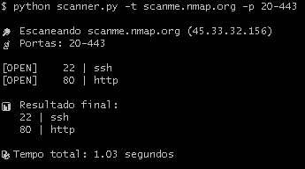

# 🔎 Port Scanner

Ferramenta simples em Python para varredura de portas TCP em um host.

---

## 🚀 Funcionalidades

* Scan de portas TCP
* Suporte a IP e domínio
* Multithreading (execução rápida)
* Identificação de serviços
* Exportação de resultados

---

## 💻 Uso

```bash
python scanner.py -t <alvo> -p <intervalo> -o <arquivo>
```

### Exemplo

```bash
python scanner.py -t scanme.nmap.org -p 20-100 -o resultado.txt
```

---

## 🧰 Tecnologias

* Python 3
* Socket
* Threading

---

## Resultado


---

## ⚠️ Aviso

Uso educacional. Não utilize sem autorização.
